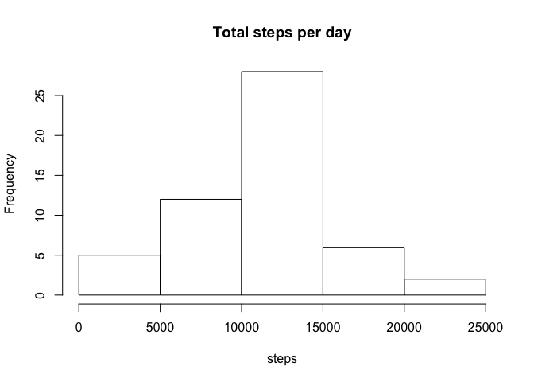
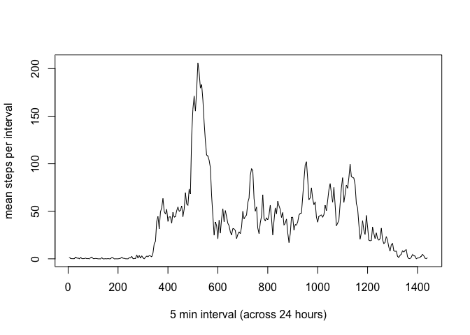
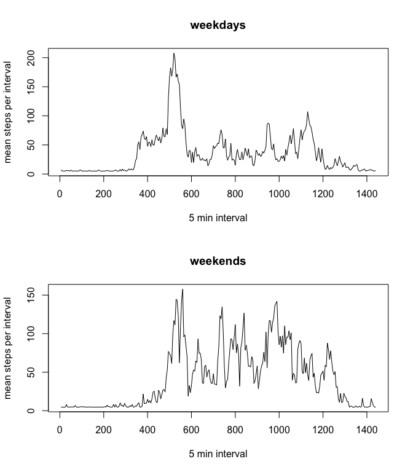

# Reproducible Research: Peer Assessment 1


## Loading and preprocessing the data

```r
unzip("activity.zip")
rawdata <- read.csv("activity.csv")
head(rawdata)
```

```
##   steps       date interval
## 1    NA 2012-10-01        0
## 2    NA 2012-10-01        5
## 3    NA 2012-10-01       10
## 4    NA 2012-10-01       15
## 5    NA 2012-10-01       20
## 6    NA 2012-10-01       25
```

```r
cleandata <- na.omit(rawdata)
head(cleandata)
```

```
##     steps       date interval
## 289     0 2012-10-02        0
## 290     0 2012-10-02        5
## 291     0 2012-10-02       10
## 292     0 2012-10-02       15
## 293     0 2012-10-02       20
## 294     0 2012-10-02       25
```


## What is mean total number of steps taken per day?

First I calcualte the total number of steps taken per day:


```r
dayselector <- unique(cleandata$date)
stepsperday <- c()
for (i in 1:length(dayselector)) {
      stepsperday <- append(stepsperday, sum(subset(cleandata, cleandata$date ==  dayselector[i])$steps))
}
head(stepsperday)
```

```
## [1]   126 11352 12116 13294 15420 11015
```

I will now draw a histogram showing the total number of steps per day


```r
hist(stepsperday, main = "Total steps per day", xlab = "steps")
```

 

then I calculate the mean an median of the total number of steps taken per day


```r
meanSteps <-mean(stepsperday)
medianSteps <- median(stepsperday)
```

Thus we have:  

- mean number of steps per day  =  10766
- median of total steps per day =  10765

## What is the average daily activity pattern?

I will now draw a time series plot of the 5 minute interval and the number of steps per interval averaged over all days:


```r
fiveminsplit <- split(cleandata, cleandata$interval)
intervalmean <- c()
for (idx in 1:length(fiveminsplit)) {
      intervalmean <- append(intervalmean, mean(fiveminsplit[[idx]]$steps))
}
for (k in 1:length(intervalmean)){
      rbind(intervalmean[k], intervalmean[k]*5)
}
df_intervalmean <- data.frame(intervalmean)
df_intervalmean$interval <- c(5*1:length(intervalmean))
plot(df_intervalmean$interval, df_intervalmean$intervalmean, type = "l", xlab = '5 min interval (across 24 hours)', ylab = "mean steps per interval")
```

 

I can now enquire which is the 5-minute interval, on average across all the days in the dataset, that contains the maximum number of steps.


```r
maxsteps <- max(df_intervalmean$intervalmean)
maxinterval <- df_intervalmean$interval[which.max(df_intervalmean$intervalmean)]
```

The maximun number of averaged steps is thus 206 occurring iat the interval 520 minutes.

## Imputing missing values

The number of missing values is given computing the follow:


```r
missing <- nrow(rawdata) - nrow(cleandata)
```

There are 2304 interval with missing values ("NA")

We shall fill these miising intervals with the mean number of steps corresponding to that interval. We will build a distinct dataframe containing data also for missing values. We shall call it completedata.


```r
completedata <- rawdata
for (i in 1:nrow(completedata)) {
      if(is.na(completedata$steps[i])) {
            completedata$steps[i] = mean(cleandata$steps)
      }
}

completestepsperday <- c()
for (i in 1:length(dayselector)) {
      completestepsperday <- append(completestepsperday,
                                    sum(subset(cleandata,
                                               cleandata$date ==  dayselector[i])$steps))
}
hist(completestepsperday, main = "Total steps per day", xlab = "steps")
```

 

I calculate the new mean and median:


```r
completemeanSteps <-mean(completestepsperday)
completemedianSteps <- median(completestepsperday)
```

In the complete set we have:

- mean number of steps per day  =  10766
- median of total steps per day =  10765

giving the same result as before introducinge fake values accounting for the missing values.


## Are there differences in activity patterns between weekdays and weekends?

First I will create a new factor variable in the dataset with two variable "weekday" and "weekends" and build a new dataset:


```r
dayType <- c()
completedata$date <- as.Date(completedata$date)

for (i in 1:nrow(completedata)) {
      if (weekdays(completedata$date[i]) == "Saturday" | (weekdays(completedata$date[i]) == "Sunday")) {
            dayType <- append(dayType, "weekend")
      }
      else {
            dayType <- append(dayType, "weekday")
      }
}

completedata_dayType <- cbind(completedata, dayType)
```

Now I will draw two time serie plot of the 5-minute interval and the average
number of steps taken, averaged across all weekday days or weekend days.  
This will give me an idea of the differences in activity between weekdays and weekends.


```r
par(mfrow = c(2,1))

weekends <- subset(completedata_dayType, completedata_dayType$dayType == "weekend")
weekdays <- subset(completedata_dayType, completedata_dayType$dayType == "weekday")


weekfiveminsplit <- split(weekdays, weekdays$interval)
weekmean <- c()
for (idx in 1:length(weekfiveminsplit)) {
      weekmean <- append(weekmean, mean(weekfiveminsplit[[idx]]$steps))
}
for (k in 1:length(weekmean)){
      rbind(weekmean[k], weekmean[k]*5)
}
df_weekmean <- data.frame(weekmean)
df_weekmean$interval <- c(5*1:length(weekmean))
plot(df_weekmean$interval, df_weekmean$weekmean, main = "weekdays", type = "l", xlab = '5 min interval', ylab = "mean steps per interval")


weekendsfiveminsplit <- split(weekends, weekends$interval)
weekendsmean <- c()
for (idx in 1:length(weekendsfiveminsplit)) {
      weekendsmean <- append(weekendsmean, mean(weekendsfiveminsplit[[idx]]$steps))
}
for (k in 1:length(weekendsmean)){
      rbind(weekendsmean[k], weekendsmean[k]*5)
}
df_weekendsmean <- data.frame(weekendsmean)
df_weekendsmean$interval <- c(5*1:length(weekendsmean))
plot(df_weekendsmean$interval, df_weekendsmean$weekendsmean, main = "weekends", type = "l", xlab = '5 min interval', ylab = "mean steps per interval")
```

 

The above plots suggest that in during weekends there is more activity with respects to weekdays in the second part of the day.
